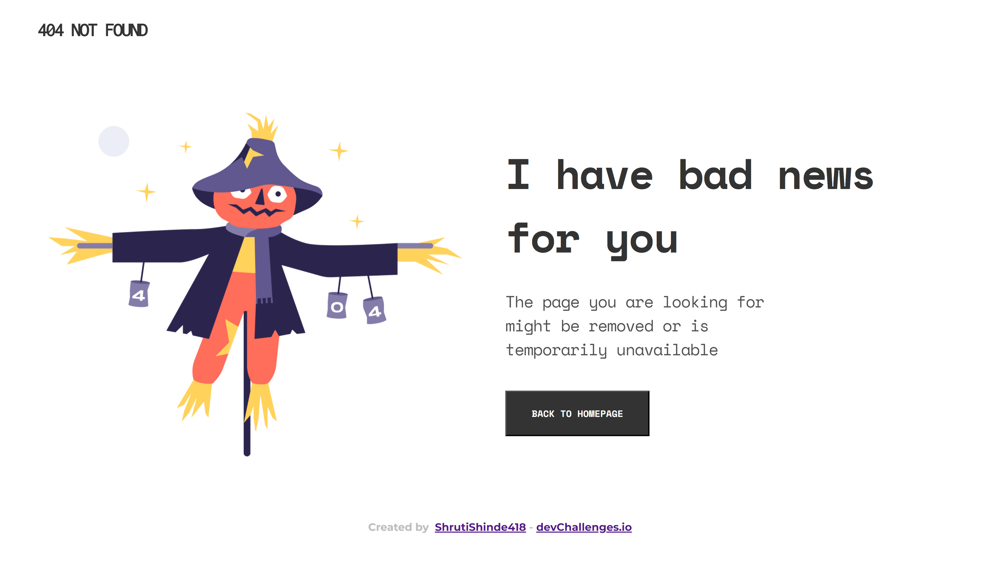

<h1 align="center">404 Not Found WebPage</h1>

   Solution for a challenge from  <a href="http://devchallenges.io" target="_blank">Devchallenges.io</a>.

  <h3>
    <a href="https://shrutishinde418.github.io/404-not-found/">
      Demo
    </a>
     | 
    <a href="https://github.com/ShrutiShinde418/404-not-found">
      Solution
    </a>
     | 
    <a href="https://devchallenges.io/challenges/wBunSb7FPrIepJZAg0sY">
      Challenge
    </a>
  </h3>

<!-- TABLE OF CONTENTS -->

## Table of Contents

- [Table of Contents](#table-of-contents)
- [Overview](#overview)
  - [Built With](#built-with)
- [Contact](#contact)

<!-- OVERVIEW -->

## Overview

- Learnt how to build responsive website using HTML and plain CSS

### Built With

- Semantic HTML 
- Vanilla CSS

This application/site was created as a submission to a [DevChallenges](https://devchallenges.io/challenges) challenge. The [challenge](https://devchallenges.io/challenges/wBunSb7FPrIepJZAg0sY) was to build an application to complete the given user stories.

## Contact

- GitHub [@ShrutiShinde418](https://{https://github.com/ShrutiShinde418})
